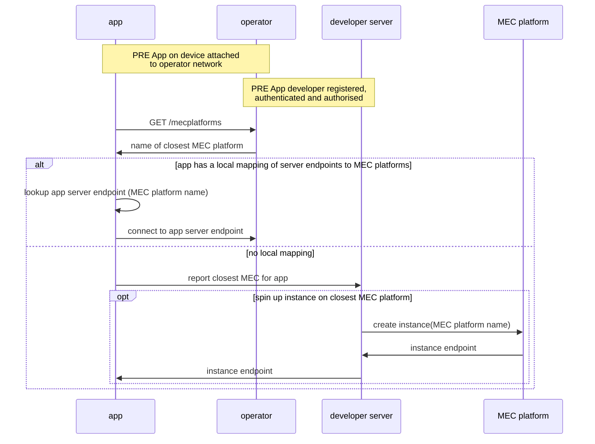
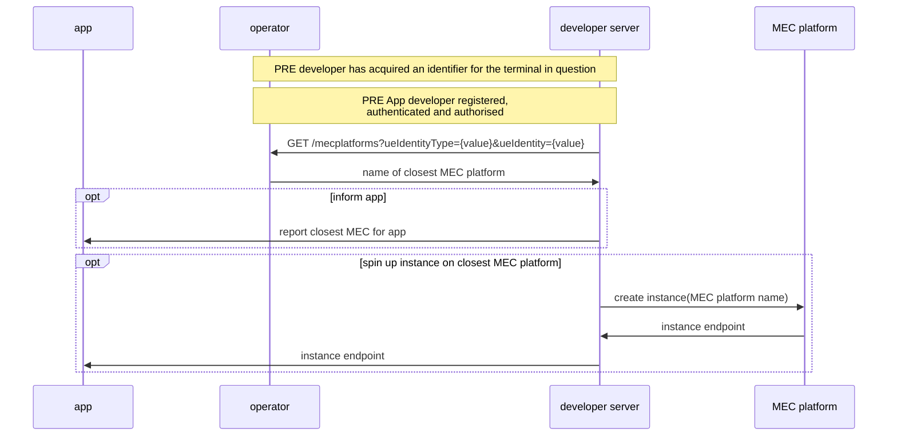

# Simple Edge Discovery (EDS) API User Story

| **Item** | **Details** |
| ---- | ------- |
| ***Summary*** | As an application developer belonging to an enterprise, I want to request (using either my application server/backend service, or an HTTP application client on the end user terminal) the closest MEC Platform to a given end user's terminal. |
| ***Roles, Actors and Scope*** | **Roles:** Customer:User  **Actors:** Application service providers, network operators, application developers. The API does not explicitly handle consent management (expects that network information related to proximity of terminal to MEC platforms is not sensitive information ) and hence end users are not included as Actors. Should this change, the actor list will be extended with end users.  
 **Scope:** | Get closest MEC platform to a target UE |
| ***Pre-conditions*** |The preconditions are listed below: <ol><li>The Customer:BusinessManager and Customer:Administrator have been onboarded to the CSP's API platform.</li><li>The Customer:BusinessManager has successfully subscribed to the EDS product from the product catalog.</li><li>The Customer:Administrator has onboarded the Customer:User to the platform.</li><li>The Customer:User has obtained a valid identifier for the target UE.</li>|
| ***Activities/Steps*** | **Starts when:** The customer application server/client makes a GET request to the EDS API to query the closest MEC platform to the target UE (an end user terminal). The target UE is either implicitly identified (e.g. by its source IP when attached to a cellular network) or explicitly identified (the identity is passed in the request querystring) **Ends when:** The EDS API responds to the customer application server|client . |
| ***Post-conditions*** | Optional - the customer may decide to act upon the information by connecting the end user application client to the application server instance hosted at the closest MEC, and/or spin up an application server instance at that closest MEC if not currently hosted there.  |
| ***Exceptions*** | the network is unable to calculate the closest MEC to the end user terminal. An HTTP 500 response code will indicate an issue with the provided end user terminal identity and that the request should not be retried without correction. HTTP 500 indicates an internal network error and the request may be retried.   |

## API Workflows
### Simple Edge Discovery
#### Scenario 1: direct request from client on terminal device

Constraints:
- Network: cellular (4G/5G)
- Application: none, browser or app calls API over HTTP
- Northbound Interface only (no 'UNI' client SDK required) 

Note:
- the MEC platform may be hosted by the operator or a 3rd party hyperscaler (in which case the developer will need an account with that hyperscaler to create instances)

#### Scenario 2: request from developer server

Constraints:
- Network: WiFi or cellular (4G/5G)
- Application: none, browser or app calls API over HTTP
- Northbound Interface only (no 'UNI' client SDK required)
- Dependency: the call must include an identifier for the terminal (UE) for which 'closest MEC' is being calculated

Note: the MEC platform may be hosted by the operator or a 3rd party hyperscaler (in which case the developer will need an account with that hyperscaler to create instances)

