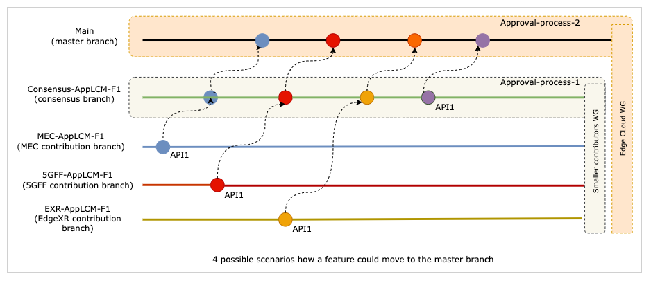

# Contributions and Approval Process

We propose creating intent based subgroups for APIs, identified for now as different subdirectories within the EdgeCloud repository. (Later these could be own repositories which offer cleaner separation)
For eg.

* Edge-discovery
* Application-LCM

 

### Branching and Approaval process
For the API/APIs where multiple contributors showcase capability overlap, the core contributors in a smaller round can agree on the first feature(API) for contribution. If for eg.  feature-1 (which has an overlap) within the intent group AppLCM is planned to be contributed, an issue gets created to mention the brief details such as agreed API name, file name, contributor list etc. This could be contributed as AppLCM-F1.MD file and can include these overview details.

Assuming we have 3 contributors for the agreed feature, the following sample branches could be created:

* MEC-AppLCM-F1
* 5GFF-AppLCM-F1
* EXR-AppLCM-F1
* CONSENSUS-AppLCM-F1

 
The core contributors group (the actual contributors of the current APIs) need to setup dedicated sessions to propose/discuss the harmonisation/convergence aspect and during this time, the pull requests (if already created at the time of branching are set in draft mode). If a consensus is reached to pick one API contribution out of the existing contributions, the contributor of the agreed spec removes the draft mode of his pull request  and the branch gets merged to CON-AppLCM-F1 so that minor changes/additions can be done.

This contributor's group could either agree on a spec from any of the individual branches as explained above, or could decide to create a hybrid spec by combining ideas from several specs (most likely outcome).  In the hybrid case, the new file is added to Con-AppLCM-F1 branch and gets worked on (and a draft pull request could be created at the time of branching to show that the branch is currently WIP). The draft mode is removed when the review stage is reached.

A pull request from the CON branch means that the spec get presented in the larger WG and volunteer reviewers get assigned to the pull request. After review & feedback from the larger WG, the pull request can either be closed and merged to main branch, closed without merge or commented to be reworked on. Merges to main branch are always done from the CON-xxx branch.

 
If no consensus could be reached in the smaller group, the discussion could be brought into the main EdgeCloud WG for a possible consensus. In rare scenarios if this is still not managed, the decision could be ported back to API-backlog WG which will follow the API onboarding guidelines and make the final decision.. It is expected that usually just the core contributors of the API are part of the smaller subgroup. But if some other contributors belonging to another intent subgroup sees areas which would impact their APIs, they could also join this subgroup and add value.

If no overlap APIs exist, the usual single stage review and approval process could be followed.

Note:

* The initial approval process could entail aligning on the underlying architecture view and the abstraction level used, or even drafting the user-story if deemed fit. These details are kept out of scope for this document.
* The general rules regarding who is allowed to make merges and if there could be default reviewers etc. are not covered within the scope of this document

 

### Ref-Platform  
We also propose setting up an additional repository called Ref-Platform (name is subject to change) EdgeXR has offered to contribute the implementation code of their reference platform to Camara. The goal would be to eventually align or refactor the implementation to match the harmonised APIs in the above-said Edge cloud subgroups, use the existing implementation from certain other API families such as QoD and Location and ensure that everything works together. This repo could be created outside the Edgecloud repo. This request will be addressed to the Steering committee.
