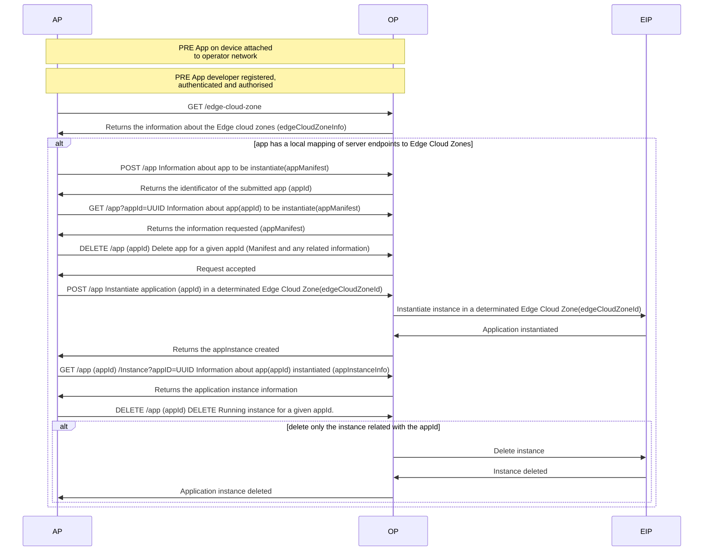

Edge Cloud Lifecycle Management User Story
_This document is based on the [CAMARA Commonalities template for User Stories](https://github.com/camaraproject/Commonalities/blob/main/documentation/Userstory-template.md)_  
_Roles are referenced from the ITU-T Cloud Refence Architecture._

## Summary
"As an Application Developer, I want to determine the Edge Cloud Zone more suitable for my application, being aware of all the options available their status and region of interest.
I want to be able to put my application available in the selected Edge Cloud Zone or Region in a simpler manner providing both artifacts and metadata for instantiating my application succesfully at the same time I want to be able to terminate
running instances of my application on a particular Edge Zone or Region and also to remove information of the whole application itself ".  

This story includes the whole journey from discovering Edge Cloud Zones available to run instances of the application and terminate them :  

## Actors, Roles, and Scope
| Actor | Role | Scope |
|-------|------|-------|
|Application Provider (AP) |API Consumer | API requester |
|Operator Platform (OP)|Edge Cloud Provider | API Publisher |
|Edge Infrastructure Provider (EIP)|Edge Cloud Provider|

Note the role of Edge Cloud Provider may be played by either the Operator or a Hyperscaler.

## Pre-conditions
The AP has a resource usage agreement with the Operator Platform

| Item | Description | Support Qualifier |
|----|----|----|
|Summary|Network operators offers a Multi-access Edge Computing platform in a given territory with several levels of abstraction being the Edge Cloud Zone the lowest one. Network operators offers a service through EdgeCloud APIs that permits application providers to deploy instances of an application in one or several Edge Cloud Zones, and to Applications Users the posibility to chose the most appropriate Edge Cloud Zone available at a given moment| M |
|Pre-conditions|The AP has a resource usage agreement with the Operator Platform| M |
|Begins when|The Application Provider (AP) invokes the EdgeCloud API to submit at application with references to obtain all needed data for their instantiation (container images or VM images and manifests describing required resources by an application)| M |
|Step 1|The OP authorizes the request (terminates with a notification to the AP if it is not valid)| M |
|Step 2|The OP validates the request (terminates with a notification to the AP if content is not valid)| M|
|Step 3|The OP stores the app information and returns an Id for reference (terminates with a notification to the AP if error)| M |
|Step 4|The OP request information of currently available Edge Cloud Zones and Regions and their status| M |
|Step 4|The AP invokes the EdgeCloud API to instantiate the application in a given Region, it can also include an specific Edge Cloud Zone referencing previously generated appId | M |
|Step 5|The OP validates the request and if AppId and parameters provided are valid, returns an object including references to one instance Id per Edge Cloud Zone with an instantiation status "instantiating" and starts deploying app instance in EdgeCloud Zones that meet the input criteria| M |
|Step 6|The AP may request updated information of existing app instances of a given app. Possible status for app instantiation includes "ready" also information for endpoint info is provided for the app instance| O |
|Step 7|App instance may provide service for end users | O |
|Step 8|The AP request termination of one app instance (optionally all app instances in a given region) | M |
|Step 8|The OP validates the request (terminates with a notification to the UE if content is not valid e.g. given appId does not exist)| M|
|Step 9|The OP response to the AP and starts the termination of the app instance, moving its status to terminating| M|
|Step 10|The UE connects to the provided EAS and start using the application| M|
|Ends when|The UE connects to the EAS| M |
|Post-conditions|The UE is connected to the most adequate EAS, it may request to reconnect (repeat Step 10) at any time if the perceived quality is not adequate| M |
|Exceptions| <ul><li>During the step 2 the , the OP can not be able to download the image</li><li>During the step 5 the Edge cloud zone resources are not available | M | 

## Flow

