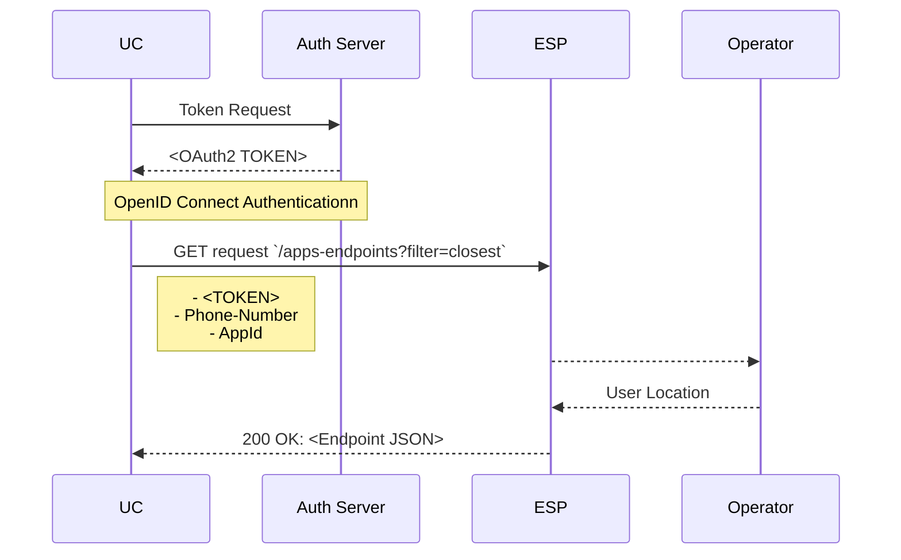

# Application Endpoint Discovery API  User Story
_This document is based on the [CAMARA Commonalities template for User Stories](https://github.com/camaraproject/Commonalities/blob/main/documentation/Userstory-template.md)_  
_Roles are referenced from the ITU-T Cloud Refence Architecture._

## Summary
"As an User, I want to connect my application to the optimal application instance running in an Edge Cloud Zone. The Application Endpoint Discovery API allows me to achieve this by providing direct access to the closest application endpoints within these zones. By using device-specific identifiers such as IP-Address, Phone-Number, or Network-Access-Identifier, I can ensure precise localization and connection to the best available endpoint. To maintain security and integrity, the API requires robust authentication and authorization processes using OpenID Connect and OAuth 2.0, with secure transmission over HTTPS and comprehensive error handling mechanisms to manage permissions and secure data transmission.".  

## Actors, Roles, and Scope
| Actor | Role | Scope |
|-------|------|-------|
|Application Provider (AP) |API Consumer | API Requester |
|Edge Platform (EP)|Edge Cloud Provider | API Publisher |
|Edge Service Provider (ESP)|Edge Cloud Provider|API Publisher
|Operator|Communications Service Provider|API Publisher
|User Client(UC)|API Consumer|API Requester

Note: the role of Edge Service Provider may be played by either the MNO or Cloud Service Providers (Hyperscalers).

| Item | Description | Support Qualifier |
|----|----|----|
|Summary|The Application Endpoint Discovery API extends the capabilities of the Simple Edge Discovery API by locating the nearest Edge Cloud Zone and directly linking to application endpoints within those zones. This API enables immediate connection to the most optimal service endpoint, optimizing the application's interaction with edge computing resources. By providing the actual endpoints, developers can instantly integrate these into their applications, improving user experience by minimizing latency and enhancing service responsiveness.| M |
|Pre-conditions|The AP has a resource usage agreement with the Operator| M |
|Begins when|The user client request access to the application| M |
|Step 1|The User invokes the Application Endpoint Discovery API to request the  endpoint of the closest Application instance to the user (user is identified using MSISDN, IP-Address, or Network-Access-Identifier).   | M |
|Step 2|The Application Endpoint Discovery API returns an endpoint of the closest application instance for this user.| M|
|Step 3|The User stablish the connectivity with the application instance| M|
|Ends when|The user successfully connects to the instance| M |

## Flow

