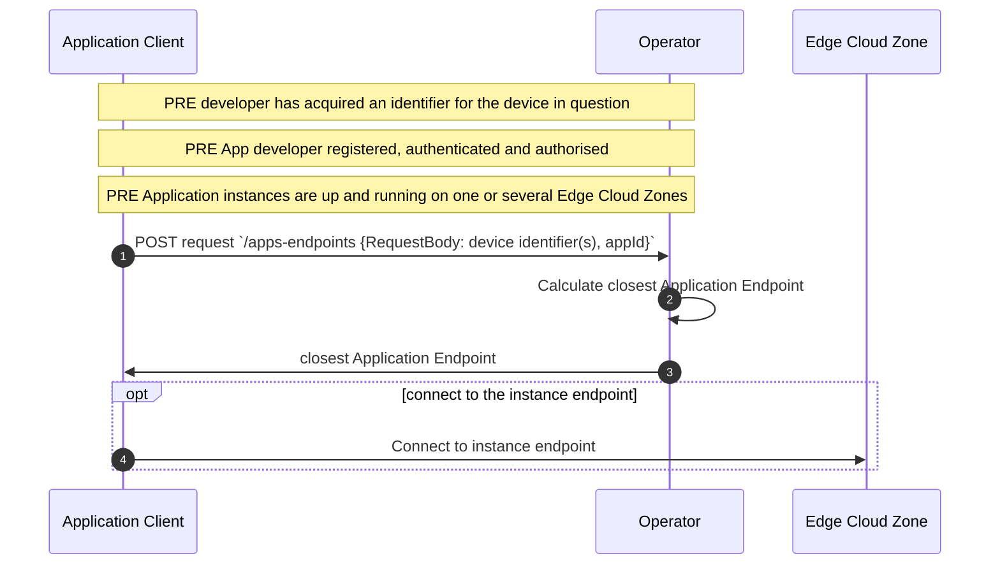
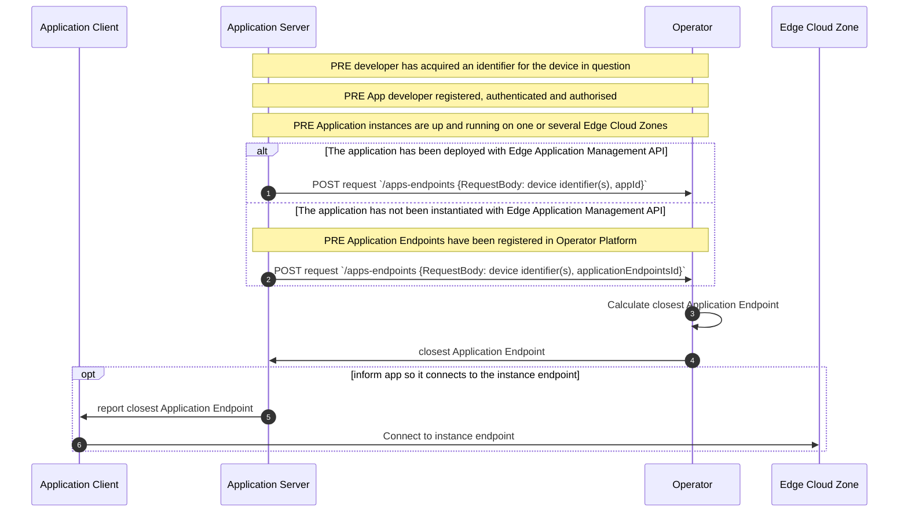

# Application Endpoint Discovery API  User Story
_This document is based on the [CAMARA Commonalities template for User Stories](https://github.com/camaraproject/Commonalities/blob/main/documentation/Userstory-template.md)_

| **Item** | **Details** |
| ---- | ------- |
| ***Summary*** | As an application developer belonging to an enterprise, I want to discover (using either my application server/backend service, or an HTTP application client on the end-user device) the optimal application instance running in an Edge Cloud Zone that a given end-user's device can connect to. |
| ***Roles and Actors and Scope*** | **Roles:** Customer:User  **Actors:** Application service providers, network operators, application developers. The API allows a check to see if end-user consent is required: if consent is required, the end-user will be an actor in the consent flow.   **Scope:** Get the endpoint of the Edge Cloud Zone exposed by the application which is closest to a given end-user's device |
| ***Pre-conditions*** |The preconditions are listed below: <ol><li>The Customer:BusinessManager and Customer:Administrator have been onboarded to the CSP's API platform.</li><li>The Customer:BusinessManager has successfully subscribed to the Simple Edge Discovery product from the product catalog.</li><li>The Customer:Administrator has onboarded the Customer:User to the platform.</li><li>The Customer:User has obtained a valid identifier for the target device, or, will make the API request from an application client on a device connected to the operator's network.</li>|
| ***Begins when*** | The customer application server/client makes a POST request to the Application Endpoint Discovery API to query the closest Application Endpoint to the target device (an end-user device). The target device is either implicitly identified (e.g. by its source IP when the request is made by an application client on a device attached to the operator network), identified in a 3-legged consent flow including a device object, or explicitly identified in the encrypted POST request header.|
| ***Ends when*** | The Application Endpoint Discovery API returns an endpoint of the closest application instance for this user.|
| ***Post-conditions*** | Optional - the customer may decide to act upon the information by connecting the end-user application client to the application server instance hosted at the recieved Application Endpoint. |
| ***Exceptions*** | Several exceptions might occur during the API operations: - Unauthorized: Invalid credentials (e.g., expired access token). - Incorrect input data (e.g., malformed phone number).  - Not found: The phone number is not associated with a CSP customer account or the application does not have any running instances in the Edge Cloud. |

## API Workflows

### Scenario 1: direct request from application client or end-user device

Constraints:
- Network: cellular (4G/5G) or fixed/Wi-Fi network with an Edge Cloud Zone deployment.
- Application: browser or app calls API over HTTPS
- Northbound Interface only (no 'UNI' client SDK required)
- The call must include an application identifier (*appId*) which must be provided by the Application Provider.

Note:
- the Edge Cloud Zone platform may be hosted by the operator or a 3rd party hyperscaler (in which case the developer will need an account with that hyperscaler to create instances)

### Scenario 2: request from developer server

Constraints:
- Network: cellular (4G/5G) or fixed/Wi-Fi network with an Edge Cloud Zone deployment.
- Application: none, browser or app calls API over HTTPs (no client SDK required)
- Dependencies: 
  - the call must include an identifier for the device (device) for which 'closest MEC' is being calculated
  - the call must include an application identifier:
    - *appId* (application identifier) in case the application is deployed by Edge Application Management API
    - *applicationEndpointsId* (registered endpoints identifier) for other cases. It requires previous registration of application endpoints using Application Endpoint Registration API 

Note: the Edge CLoud Zone platform may be hosted by the operator or a 3rd party hyperscaler (in which case the developer will need an account with that hyperscaler to create instances)

