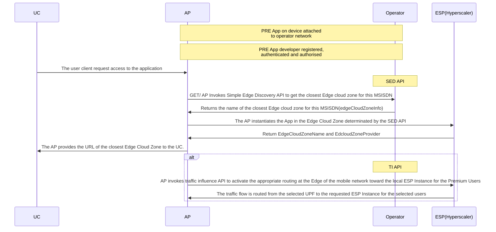
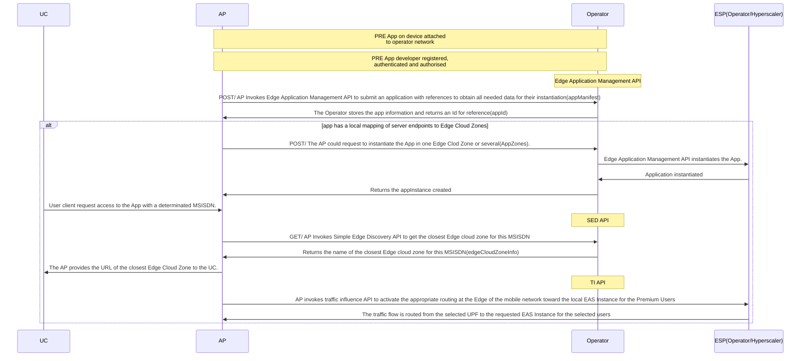
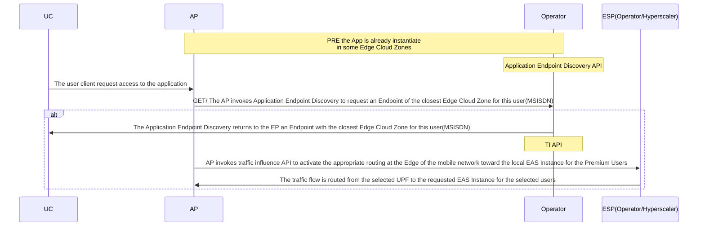

# Edge Cloud APIs User Story
_This document is based on the [CAMARA Commonalities template for User Stories](https://github.com/camaraproject/Commonalities/blob/main/documentation/Userstory-template.md)_  
_Roles are referenced from the ITU-T Cloud Refence Architecture._

## Summary
"As an Application Developer, I want to determine the Edge Cloud Zone more suitable for my application, being aware of all the options available their Status, Region and Edge Cloud Zone provider of interest.
I want to be able to put my application available in the selected Edge Cloud Zone in a simpler manner providing both artifacts and metadata for instantiating my application succesfully at the same time I want to be able to terminate running instances of my application on a particular Edge Cloud Zone and also to remove information of the whole application itself ".  

This story includes the whole journey from the Edge Cloud APIs with a couple of examples about the use of these APIs to improve the deployment experience of the APs:
## Edge Cloud APIs
| API | Description|
|-------|------|-------|
|Application Endpoint Discovery(AED) |The Application Discovery API extends beyond the capabilities of the Simple Edge Discovery API by not only locating the nearest Edge Cloud Zone but also directly linking to the application endpoints within those zones. |
|Edge Application Management(EAM)|Edge Application Management API allows API consumers to manage the Life Cycle of an Application and to Discover Edge Cloud Zones. 
|Simple Edge Discovery(SED)|The Simple Edge Discovery API returns the name of the closest operator Edge Cloud Zone to a particular user device.
|Traffic Influence(TI)|The TI API provides the capability to establish the optimal routing, in terms of latency, in a specific geographical area, between the user Device, e.g. the user’s smartphone, and the optimal EAS instance nearby.

To further information about each API, review the User story of each  one, which is available in the corresponding repository. 
The purpose of this user story is to have a general picture of the life cycle management of the Edge cloud family APIs.

## Actors, Roles, and Scope
| Actor | Role | Scope |
|-------|------|-------|
|Application Provider (AP) |API Consumer | API Requester |
|Edge Platform (EP)|Edge Cloud Provider | API Publisher |
|Edge Service Provider (ESP)|Edge Cloud Provider|API Publisher
|Operator|Communications Service Provider|API Publisher
|User Client(UC)|API Consumer|API Requester

Note: the role of Edge Service Provider may be played by either the MNO or Cloud Service Providers (Hyperscalers).

#### Scenario 1: Request triggered by the AP and the Hyperscaler will host the App.

| Item | Description | Support Qualifier |
|----|----|----|
|Summary|Edge Service Providers offers an Edge  platform that exposes computing and networking services in a given territory with several levels of abstraction being the Edge Cloud Zone the lowest one. Edge Service Providers offers a service through EdgeCloud APIs that permits application providers to deploy instances of an application in one or several Edge Cloud Zones, and to Applications Users the posibility to chose the most appropriate Edge Cloud Zone available at a given moment| M |
|Pre-conditions|The AP has a resource usage agreement with the Operator| M |
|Begins when|The user client request access to the application| M |
|Step 1|The AP invokes Application Endpoint Discovery to request an Endpoint of the closest Edge Cloud Zone for this user(MSISDN)| M |
|Step 2|The Application Endpoint Discovery returns to the EP an Endpoint with the closest Edge Cloud Zone for this user(MSISDN) | M|
|Step 3|The AP instantiates the App in the Edge Cloud Zone determinated by the SED API| M|
|Step 4|Once the App is istantiated the ESP returns the information about the Edge Cloud Zone where the App is instantiated| M|
|Step 5|The AP provides the user client the corresponding URL to connected| M|
|Step 6|The UE connects to the provided URL and start using the application| M|
|Step 7|The AP invokes traffic influence API to activate the appropriate routing at the Edge of the mobile network toward the local ESP Instance for the Premium Users| M|
|Step 8|The traffic flow is routed from the selected UPF to the requested ESP Instance for the selected users| M|
|Step 9|The UE connects to the provided EAS and start using the application| M|
|Ends when|The UE connects to the ESP| M |
|Post-conditions|The UE is connected to the most adequate ESP, it may request to reconnect (repeat Step 7) at any time if the perceived quality is not adequate| M |

## Flow

#### Scenario 2: Request triggered by the AP and the Operator will host the App.

| Item | Description | Support Qualifier |
|----|----|----|
|Summary|Edge Service Providers offers an Edge  platform that exposes computing and networking services in a given territory with several levels of abstraction being the Edge Cloud Zone the lowest one. Edge Service Providers offers a service through EdgeCloud APIs that permits application providers to deploy instances of an application in one or several Edge Cloud Zones, and to Applications Users the posibility to chose the most appropriate Edge Cloud Zone available at a given moment| M |
|Pre-conditions|The AP has a resource usage agreement with the owner of the Edge Platform| M |
|Begins when|The Application Provider (AP) invokes the Edge Application Management API to submit an application with references to obtain all needed data for their instantiation (container images or VM images and manifests describing required resources by an application)| M |
|Step 1|The Operator authorizes the request (terminates with a notification to the AP if it is not valid)| M |
|Step 2|The Operator validates the request (terminates with a notification to the AP if content is not valid)| M|
|Step 3|The Operator stores the app information and returns an Id for reference (terminates with a notification to the AP if error)| M |
|Step 4|The Edge Application Management API instantiate the application in an specific Edge Cloud Zone or serverals | M |
|Step 5|The Operator validates the request and if AppId and parameters provided are valid, returns an object including references to one instance Id per Edge Cloud Zone with an instantiation status "instantiating" and starts deploying app instance in EdgeCloud Zones that meet the input criteria| M |
|Step 6|The AP may request updated information of existing app instances of a given app. Possible status for app instantiation includes "ready" also information for endpoint info is provided for the app instance| O |
|Step 7|The Operator response to the AP and starts the termination of the app instance, moving its status to terminating| M|
|Step 8|An User Client solicitates access to the Application | M|
|Step 9|The Operator invokes SED API to request information of the closest Edge Cloud zone currently available | M |
|Step 10|The SED API returns the closest Edge Cloud Zone to the OP | M |
|Step 11|The AP provides the URL with the closest Edge Cloud Zone to the UC | M |
|Step 12|The UC connects to the provided EAS and start using the application| M|
|Step 13|The AP invokes traffic influence API to activate the appropriate routing at the Edge of the mobile network toward the local EAS Instance for the Premium Users| M|
|Step 14|The traffic flow is routed from the selected UPF to the requested ESP Instance for the selected users| M|
|Ends when|The UE connects to the ESP| M |
|Post-conditions|The UE is connected to the most adequate ESP, it may request to reconnect (repeat Step 13) at any time if the perceived quality is not adequate| M |

## Flow

#### Scenario 3: Request triggered by the User.

| Item | Description | Support Qualifier |
|----|----|----|
|Summary|Network operators offers a Multi-access Edge Computing platform in a given territory with several levels of abstraction being the Edge Cloud Zone the lowest one. Network operators offers a service through EdgeCloud APIs that permits application providers to deploy instances of an application in one or several Edge Cloud Zones, and to Applications Users the posibility to chose the most appropriate Edge Cloud Zone available at a given moment| M |
|Pre-conditions|The application is already deployment and the user has access to the application by the market place| M |
|Begins when|The user client request access to the application| M |
|Step 1|The AP invokes Application Endpoint Discovery to request an Endpoint of the closest Edge Cloud Zone for this user(MSISDN)| M |
|Step 2|The Application Endpoint Discovery returns to the EP an Endpoint with the closest Edge Cloud Zone for this user(MSISDN) | M|
|Step 3|The OP invokes Application Endpoint Discovery API to request information of the closest Edge Cloud zone currently available | M |
|Step 4|The Application Endpoint Discovery API returns the endpoint for the closest Edge Cloud Zone to the user | M |
|Step 5|The UE connects to the provided ESP and start using the application| M|
|Step 6|The AP invokes traffic influence API to activate the appropriate routing at the Edge of the mobile network toward the local ESP Instance for the Premium Users| M|
|Step 7|The traffic flow is routed from the selected UPF to the requested ESP Instance for the selected users| M|
|Step 8|The UE connects to the provided ESP and start using the application| M|
|Ends when|The UE connects to the EAS| M |
|Post-conditions|The UE is connected to the most adequate ESP, it may request to reconnect (repeat Step 6) at any time if the perceived quality is not adequate| M |

## Flow

