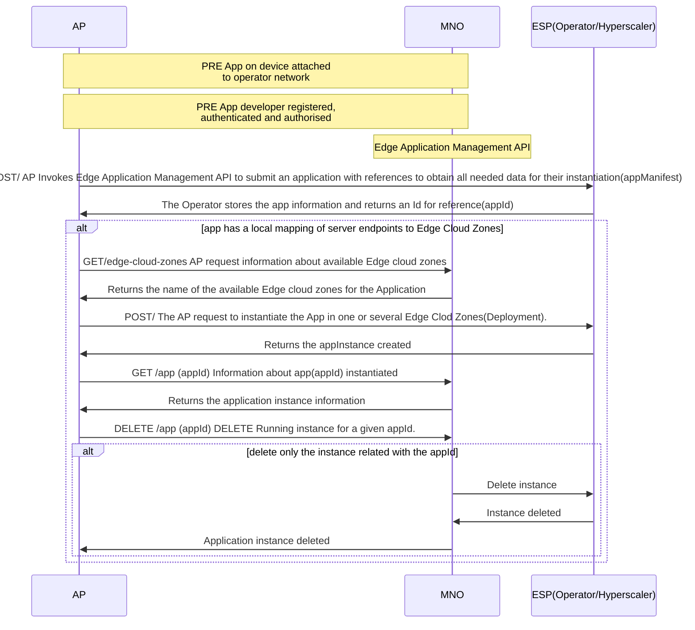

## Actors, Roles, and Scope
| Actor | Role | Scope |
|-------|------|-------|
|Application Provider (AP) |API Consumer | API Requester |
|Edge Service Provider (ESP)|Edge Cloud Provider|API Publisher |
|MNO|Communications Service Provider|API Publisher |
|User Client(UC)|API Consumer|API Requester |

Note: the role of Edge Service Provider may be played by either the MNO or Cloud Service Providers (Hyperscalers).

| Item | Description | Support Qualifier |
|----|----|----|
|Summary|Network operators offers a Multi-access Edge Computing platform in a given territory with several levels of abstraction being the Edge Cloud Zone the lowest one. Network operators offers a service through EdgeCloud APIs that permits application providers to deploy instances of an application in one or several Edge Cloud Zones, and to Applications Users the posibility to chose the most appropriate Edge Cloud Zone available at a given moment| M |
|Pre-conditions|The AP has a resource usage agreement with the Operator Platform| M |
|Begins when|The Application Provider (AP) invokes the Edge Application Management API to submit an application with references to obtain all needed data for their instantiation (container images or VM images and manifests describing required resources by an application)| M |
|Step 1|The ESP stores the app information and returns an Id for reference (terminates with a notification to the AP if error)| M |
|Step 2|The Application Provider (AP) request information of currently available Edge Cloud Zones and their status | M|
|Step 3|The MNO provides the availables Edge Cloud Zones where the AP could instantiate the Application| M |
|Step 4|The AP instantiates the application in one Edge Cloud Zone or in Severals| M|
|Step 5|The ESP response to the AP appInstance created| M |
|Step 6|The AP may request updated information of existing app instances of a given app. Possible status for app instantiation includes "ready" also information for endpoint info is provided for the app instance| O |
|Step 7|App instance may provide service for end users | O |
|Step 8|The AP request termination of one app instance (optionally all app instances in a given region) | M |
|Step 9|The OP validates the request (terminates with a notification to the UE if content is not valid e.g. given appId does not exist)| M|
|Step 10|The OP response to the AP and starts the termination of the app instance, moving its status to terminating| M|
|Ends when|The UE connects to the EAS| M |

## Flow

