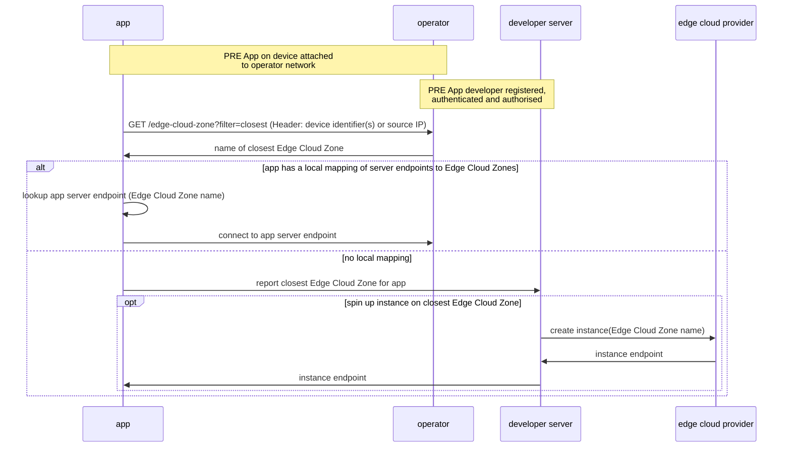
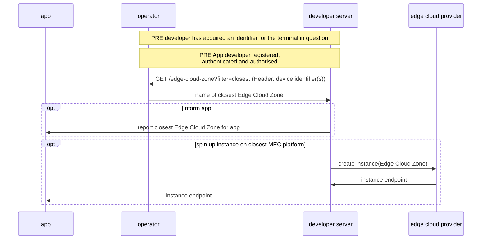

# Simple Edge Discovery User Story
_This document is based on the [CAMARA Commonalities template for User Stories](https://github.com/camaraproject/Commonalities/blob/main/documentation/Userstory-template.md)_  
_Roles are referenced from the ITU-T Cloud Refence Architecture._

## Summary
"As an Application Developer, I want to determine the Edge Cloud Zone with the shortest network path to a particular end user, so that I can minimise the network packet delay and improve the end user's experience".  

This story has two outcomes:  

"As an Application Developer, once I have discovered the closest Edge Cloud Zone, then either  

Outcome 1) I can connect the application client to my server hosted on that Edge Cloud Zone, using my previous knowledge of the endpoint (IP address) for that particular server..  

Outcome  2) _Using another tool e.g. edge cloud provider dashboard or CLI_, I can deploy an application server to the Edge Cloud Zone indicated in the API response, and then connect the application client to that server's IP address."  

The story covers two scenarios:   
1. Request made from network-attached application client  
2. Request made from Internet-hosted application server  
   

## Actors, Roles, and Scope
| Actor | Role | Scope |
|-------|------|-------|
|App Developer |CSC: User | API request|
|Developer Admin |CSC: Administrator, CSC: Business Manager |Prospect to Order (P2O)|
|Operator|Edge Cloud Provider, API Publisher |
|Hyperscaler|Edge Cloud Provider|

Note the role of Edge Cloud Provider may be played by either the Operator or a Hyperscaler.

## Pre-conditions
1. App Developer has succesfully registered to use the Simple Edge Discovery API for the Operator (or, the Developer Admin has performed this on the App Developer's behalf)
2. App Developer has succesfully registered to deploy applications on the Edge Cloud Zone(s) of the Edge Cloud Provider (or, the Developer Admin has performed this on the App Developer's behalf). 
(Note, the API may still be called without this pre-condition, but the APP Developer will not be able to fulfil the Goal described above).

# Scenario 1: Network-attached application client initiates API request
Constraints:
- Network: cellular (4G/5G) or Wi-Fi. If the operator only provides a cellular edge cloud then Wi-Fi connected devices will be out of scope for thier implemementation of this API.
- Application: none, browser or app calls API over HTTP
- Northbound Interface only (no 'UNI' client SDK required) 

Note:
- the Edge Cloud Zone may be hosted by the operator or a 3rd party hyperscaler (in which case the developer will need an account with that hyperscaler to create instances)

## Begins When

## Post conditions
The App Developer is now aware of the closest Edge Cloud Zone to the device passed in the API request, , and may enact one of the outcome options shown in the sequence diagram above.

## Exceptions
If the device identified is on an operator network that does not have access to an Edge Cloud Zone (for example, an operator may have a mobile edge but no fixed edge) then the API call will fail.

# Scenario 2: Internet-hosted application server initiates API request
Constraints:
- Network: cellular (4G/5G) or Wi-Fi. If the operator only provides a cellular edge cloud then Wi-Fi connected devices will be out of scope for thier implemementation of this API.
- Application: none, browser or app calls API over HTTP
- Northbound Interface only (no 'UNI' client SDK required)
- Dependency: the call must include an identifier for the terminal (UE) for which 'closest Edge Cloud Zone' is being calculated

Note: the Edge Cloud Zone may be hosted by the operator or a 3rd party hyperscaler (in which case the developer will need an account with that hyperscaler to create instances)

## Begins When

## Post conditions
The App Developer is now aware of the closest Edge Cloud Zone to the device passed in the API request, and may enact one of the outcome options shown in the sequence diagram above.

## Exceptions
If the device identified is on an operator network that does not have access to an Edge Cloud Zone (for example, an operator may have a mobile edge but no fixed edge) then the API call will fail.
