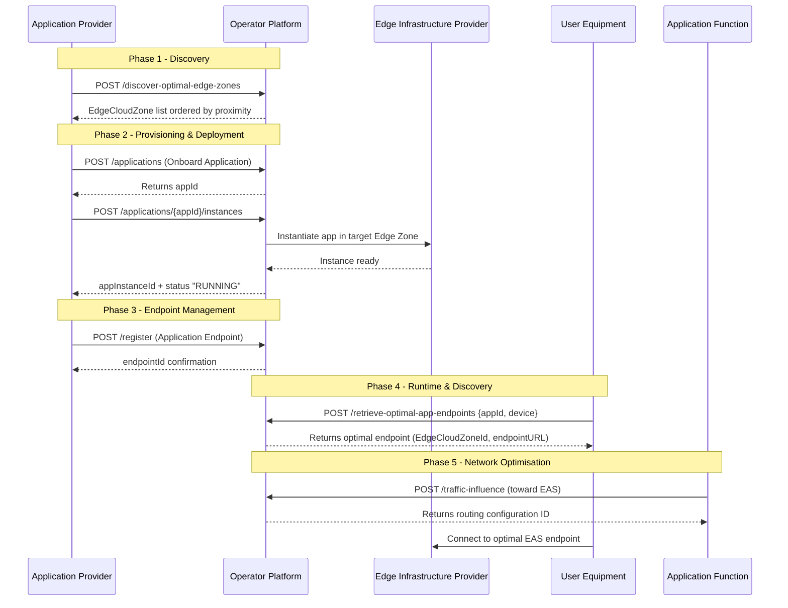

# Edge Cloud Intents and API Mapping – Harmonisation Document

_This document is based on the [CAMARA Commonalities template for User Stories](https://github.com/camaraproject/Commonalities/blob/main/documentation/Userstory-template.md) and references ITU-T Cloud Reference Architecture roles._

---

## 1. Summary

This document provides a harmonised view of **EdgeCloud Intents** and their corresponding **CAMARA APIs**, consolidating the functional flow across discovery, deployment, runtime, and termination stages of the **Edge Cloud lifecycle**.

The purpose is to bridge earlier MEC & Deployment API proposals with the current **CAMARA Edge Cloud family of APIs**, ensuring a unified lifecycle from **Zone discovery** to **Application endpoint registration and discovery**.

---

## 2. Objectives

- To define the **intents** supporting the lifecycle of Edge-hosted applications.
- To map these intents to existing and emerging **CAMARA APIs**.
- To support interoperability between **Operator Platforms** and **Application Providers**.
- To prepare the foundation for future harmonisation across **Edge, Application Management, and Network APIs** (e.g., Traffic Influence).

---

## 3. Roles, Actors, and Scope

| Actor | Role | Scope |
|-------|------|-------|
| Application Provider (AP) | API Consumer | API requester, deploys applications and manages instances. |
| Operator Platform (OP) | Edge Cloud Provider | API publisher, orchestrates resources and exposes APIs. |
| Edge Infrastructure Provider (EIP) | Edge Cloud Provider | Hosts and manages the physical/virtual infrastructure. |
| End User (UE) | Service Consumer | Interacts with applications hosted at the edge. |

> Note: Edge Cloud Provider may be the Operator or a Hyperscaler.

---

## 4. EdgeCloud Lifecycle Intents Overview

| **Intent ID** | **Intent Name** | **Purpose** | **Mapped CAMARA API(s)** |
|----------------|----------------|--------------|---------------------------|
| Intent 1 | Discover EdgeCloud Zones | Identify available edge zones, their regions, and capabilities. | `Optimal Edge Discovery API` |
| Intent 3 | Retrieve Zone Information | Obtain metadata about edge zones and their resource status. | `Simple Edge Discovery API` |
| Intent 5 | Register and Manage Applications | Register application artifacts and metadata for instantiation. | `Edge Application Management API` |
| Intent 7 | Instantiate Application | Deploy a registered application instance on one or more Edge Zones. | `Edge Application Management API` |
| Intent 9 | Register Application Endpoints | Record operational endpoints for deployed application instances. | `Application Endpoint Registration API` |
| Intent 11 | Discover Optimal Endpoints | Determine best-performing or geographically closest endpoint for an end-user device. | `Application Endpoint Discovery API` |
| Intent 13 | Influence Network Traffic | Route premium user traffic toward specific edge instances. | `Traffic Influence API` |
| Intent 18 | Terminate Application | Decommission instances and remove registration information. | `Edge Application Management API` |

---

## 5. Harmonised EdgeCloud Lifecycle Flow

```mermaid
flowchart LR
    A[Intent 1: Discover Edge Zones] --> B[Intent 3: Retrieve Zone Info]
    B --> C[Intent 5: Register Application]
    C --> D[Intent 7: Instantiate Application]
    D --> E[Intent 9: Register Application Endpoints]
    E --> F[Intent 11: Discover Optimal Endpoints]
    F --> G[Intent 13: Apply Traffic Influence - optional]
    G --> H[Intent 18: Terminate Application]
```

# CAMARA EdgeCloud Harmonisation Analysis

## 7. Harmonisation Analysis

### 7.1 API Relationship Summary

- **Simple Edge Discovery**: Provides baseline nearest-zone discovery using network proximity.
- **Optimal Edge Discovery**: Extends discovery with richer metadata (zone characteristics, latency, region).
- **Edge Application Management**: Enables deployment and lifecycle control of applications in these zones.
- **Application Endpoint Registration**: Establishes registry of deployed endpoints.
- **Application Endpoint Discovery**: Allows clients or servers to dynamically retrieve optimal endpoints.
- **Traffic Influence**: Complements discovery and lifecycle by providing routing enforcement at the network level.

### 7.2 Common Design Principles

- **Entity Alignment**: Shared objects (e.g., `edgeCloudZoneId`, `appId`, `endpointId`) across all APIs.
- **Security Consistency**: All APIs assume OAuth2-based access with clear roles.
- **Consent Integration**: Optional per API (explicit in Discovery and Endpoint APIs).
- **Operator Neutrality**: APIs work across multiple operators via federated exposure models.

**Conclusion**: CAMARA EdgeCloud APIs collectively address all intents from earlier MEC proposals, forming a continuous lifecycle from discovery → provisioning → runtime → termination.

## 8. Harmonised Data Model Overview

| Entity | Description | Referenced In |
|--------|-------------|---------------|
| `edgeCloudZoneId` | Identifier of Edge Cloud Zone | Discovery, Lifecycle, Endpoint APIs |
| `appId` | Unique application identifier | Lifecycle, Endpoint Discovery |
| `appInstanceId` | Deployed instance ID | Lifecycle API |
| `endpointId` | Registered endpoint for a deployed instance | Endpoint Registration & Discovery |
| `deviceId` | Device identifier or token | Discovery and Endpoint Discovery APIs |
| `trafficInfluenceId` | Identifier for a network routing session | Traffic Influence API |

## 9. Inter-API Dependencies

| API | Depends On | Dependency Description |
|-----|------------|------------------------|
| Optimal Edge Discovery | None | Can be used standalone for planning |
| Edge Application Management | Optimal Edge Discovery | Uses discovered zones for deployment decisions |
| Application Endpoint Registration | Edge Cloud Lifecycle Management | Registers endpoints of instantiated applications |
| Application Endpoint Discovery | Endpoint Registration | Discovers registered endpoints |
| Traffic Influence | Endpoint Discovery | Optimises routing to discovered endpoints |

**Harmonised APIs together enable a complete closed loop**:  
Discovery → Deployment → Registration → Discovery (endpoint) → Influence → Termination.

## 10. Open Harmonisation Topics

| Area | Description | Next Step |
|------|-------------|-----------|
| Unified Discovery Schema | Align Simple and Optimal Edge Discovery response objects | Define a shared `EdgeCloudZoneInfo` schema |
| Cross-API Security Scopes | Establish unified OAuth2 roles and scopes | Coordinate with Commonalities WG |
| Consent Management | Define consistent consent-handling process across Discovery and Endpoint APIs | Align with Privacy & Consent WG |
| Federated Operations | Support discovery and lifecycle across multi-operator environments | Introduce Edge Federation API concept |
| Traffic Policy Automation | Enable dynamic network steering based on real-time metrics | Collaborate with Network API group |

## 11. References

- **CAMARA – Simple Edge Discovery API**: [User Story](https://github.com/camaraproject/SimpleEdgeDiscovery/blob/main/documentation/API_documentation/SimpleEdgeDiscovery_User_Story.md)
- **CAMARA – Optimal Edge Discovery API**: [User Story](https://github.com/camaraproject/OptimalEdgeDiscovery/blob/main/documentation/API_documentation/optimal-edge-discovery-User-Story.md)
- **CAMARA – Edge Application Management**: [User Story](https://github.com/camaraproject/EdgeCloud/blob/main/documentation/SupportingDocuments/API_Documentation/User%20Stories/Edge.Cloud.Lifecycle.Management.User.Story.md)
- **CAMARA – Application Endpoint Registration API**: [User Story](https://github.com/camaraproject/ApplicationEndpointRegistration/blob/main/documentation/API_documentation/application-endpoint-registration-User-Story.md)
- **CAMARA – Application Endpoint Discovery API**: [User Story](https://github.com/camaraproject/ApplicationEndpointDiscovery/blob/main/documentation/SupportingDocuments/API_Documentation/User%20Stories/Application%20Endpoint%20Discovery%20User%20Story.md)
- **CAMARA – Traffic Influence API**: [User Story](https://github.com/camaraproject/TrafficInfluence/blob/main/documentation/API_documentation/traffic-influence-user-story-use-case-1.md)
- **GSMA – Open Gateway & CAMARA Harmonisation Framework**: [Reference](https://www.hcltech.com/sites/default/files/documents/resources/whitepaper/files/2024/09/16/gsma-open-gateway.pdf?utm_source=chatgpt.com)

