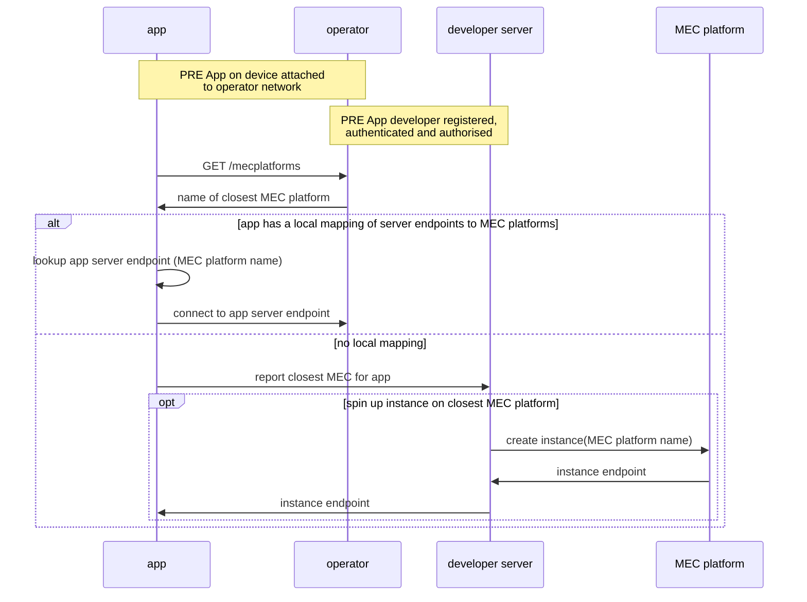
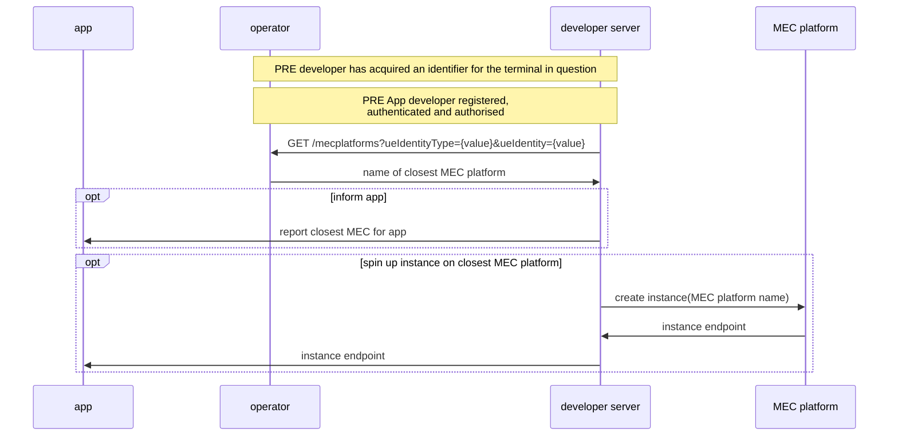

# Describing and harmonising the Edge APIs
## Abstract
Several 'edge cloud' APIs have been proposed for CAMARA. 
- 5GFF have contributed [Simple Edge Discovery](https://github.com/camaraproject/EdgeCloud/blob/main/code/API_definitions/simple_edge_discovery.yaml), and [MEC Exposure and Experience Management](https://github.com/camaraproject/EdgeCloud/blob/main/code/API_definitions/MEC%20exposure%20and%20experience%20management.yaml).
- EdgeXR have contributed [application client edge interaction APIs](https://github.com/camaraproject/EdgeCloud/blob/main/code/API_definitions/app-client.yaml), [Controller APIs for Apps)](https://github.com/camaraproject/EdgeCloud/blob/main/code/API_definitions/App.yaml) and a [Session management API](https://github.com/camaraproject/EdgeCloud/blob/main/code/API_definitions/session.yaml).
- GSMA OPAG/Capgemini have contributed the [MEC Edge Cloud API](https://github.com/camaraproject/EdgeCloud/blob/main/code/API_definitions/EdgeCloudApi_v0.0.5.yaml)

The goal is to harmonise/combine the APIs into a single set of definitions. This document provides information to meet that goal, including:
- listing all the intents delivered by the APIs, from both developer and operator perspectives,
- listing the constraints of each API,
- illustrating the workflow of each API,
- identifying and agreeing diffrences in terminology between the APIs,
- aligning to the Camara Commonalities [API design guidelines](https://github.com/camaraproject/WorkingGroups/blob/main/Commonalities/documentation/API-design-guidelines.md) when it is finalised.

## A brief description of the various APIs
 'Simple Edge Discovery' only has one operation, to GET the name of the closest MEC to the network-attached device that hosts the application that made the API request (e.g. an app on a smartphone). 'Simple Edge Discovery' is a subset of the 'MEC Exposure and Experience Management' API.
 
The 5GFF 'MEC Exposure and Experience Management', EdgeXR, and CapGemini APIs are richer APIs that include Edge aplication lifecycle workflows and session management. The EdgeXR and GSMA OPAG/Capgemini APIs are based on GSMA Operator Platform architecture. 

_(Editor note: do both EdgeXR and GSMA OPAG/Capgemini definitions require UNI for execution on a UE?)_

_Note, the [Traffic Influence API](https://github.com/camaraproject/EdgeCloud/blob/main/code/API_definitions/Traffic_Influence.yaml) in the Edge Cloud repository covers a different scenario and is not discussed here._ 

## Terminology used
Please refer to the [Edge Terminology document](https://github.com/camaraproject/EdgeCloud/blob/main/documentation/Contributions/edge_terminology.md)

## Intents and mapping to APIs
How to use this table: 
- If an API supports an intent its name will appear in **bold**. 
- If an API does not support an intent, its name is in ~~strikethrough.~~ 
- If an API partially supports an intent, or we are not sure, its name is in _italics_ and followed by a '?'
Abbreviations used for API names: 
- 5SED = 5GFF Simple Edge Discovery
- 5MEE = 5GFF MEC Exposure & Experience Management
- EXRC = EdgeXR application client edge interaction APIs
- EXCA = EdgeXR Controller APIs for Apps
- EXSM = EdgXR Session Management API
- GMEC = GSMA OPAG/Capgemini MEC Edge Cloud API

### Developer intents
#### Provisioning intents 
1.	“I can retrieve a list of the operator’s MECs and their status, ordering the results by location and filtering by status (active/inactive/unknown)” ~~5SED~~ **5MEE** **EXRA**
2.	"I can discover the capabilities/resources available at an operator’s MEC: CPU, Memory, Storage, GPU" ~~5SED~~ **5MEE** **EXRA**
3.	"I can discover the geographical regions covered by the operators MECs" ~~5SED~~ **5MEE** **EXRA**
4.	"I can discover the closest MEC platform to a specific terminal (closest in terms of shortest network path)" **5SED** **5MEE** **EXRC**
5.	"I can ask the operator to provision my application server to the optimal MEC for a specific terminal, taking into account connectivity, resources (e.g. vCPU, Memory, network interfaces, storage, GPU) shortest network path, cost, network load, MEC platform load, application privacy considerations etc." ~~5SED~~ **5MEE** **EXRA** **GMEC**
  *  "I can ask the operator to provision my application server to all MECs that meet these criteria (note this is not focussing on a specific terminal)" 
  *  "I can ask the operator to provision my application server to a minimal set of MECs that meet these criteria across a given footprint (note this is not focussing on a specific terminal)" 
6.	 "I can ask the operator to inform me if the optimal MEC for my application and a specific terminal changes, taking into account mobility events, connectivity, shortest network path, cost, network load, MEC platform load etc." ~~5SED~~ **5MEE** **EXRC**
7.	“I can ask the operator to store artifacts e.g., container images or VM images and manifests describing required resources, Helm charts etc”  **GMEC**
8.	“I can ask the operator to provide the artifacts details for already stored artifacts”  **GMEC**
9.	“I can query the list of applications linked with a given artifact”  **GMEC**
10.	"I can ask the operator to link artifacts to the applications when onboarding my applications"  **GMEC**
11.	"I can ask the operator to delete an existing artifact(s)"  **GMEC**
12.	"I can ask the operator to reserve compute, network and storage required for my application in various MEC locations"  **GMEC**
13.	“I can ask the operator to use reserved resources for my application to earlier on various MEC locations”  **GMEC**
14.		"I can ask the operator to delete an existing reserve reservation"  **GMEC**
15.	“I can ask the operator to remove my application from a set of MEC locations”  **GMEC**
16.	“I can ask the operator to provide the details of all the onboarded applications”  **5MEE** **GMEC**
17.	"I can ask the operator to inform about the application instance details e.g., communication endpoints, resource consumed etc" **5MEE** **GMEC**
18.	"I can ask the operator to terminate the running instance of my application"  **GMEC**

#### Runtime intents 
19.    "I can discover the closest MEC platform to a particular terminal (closest in terms of shortest network path)" **5SED** **5MEE** **EXRC**
20.    "I can discover the optimal MEC platform for my application and a particular terminal, taking into account connectivity, shortest network path, cost, network load etc." (`A`) ~~5SED~~ **5MEE** **EXRC**
21.    "I can discover the optimal application service endpoint for a specific terminal, taking into account mobility events, connectivity, shortest network path, cost, network load, MEC platform load etc." ~~5SED~~ **5MEE** **EXRC**
22.   "I can ask the operator to move my running application instance to a different MEC if the closest MEC changes, taking into account mobility events, connectivity, shortest network path, cost, network load, MEC platform load etc." `B` ~~5SED~~ _5MEE?_ _EXRC_?
### Operator intents
#### Provisioning intents
23. “I can publish an (ordered, filtered) list of my MECs, their coverage, capabilities and status” _(aligns with 1,2,3 in the developer intents)_ ~~5SED~~ **5MEE** **EXRA**
24. “I can map an application’s requirements to the best MEC for hosting it, based on application demands for CPU,Memory,Storage,GPU,bandwith,Network forecast, mobility” _(aligns with 4,5,8,9)_ ~~5SED~~ **5MEE** **EXRA**
#### Runtime intents 
25. “I can inform the developer of any event which changes which MEC is optimal for their application and connected terminals” _(aligns with  6)_ ~~5SED~~ **5MEE** **EXRC**
26. “I can move a running application to a new MEC and inform the developer of the new service endpoint to connect to” `B` _(aligns with 10)_ ~~5SED~~ _5MEE?_ _EXRC_?

**Notes**: 
* `A` this may not be the closest MEC, rather the 'best MEC for this job' which accounts for current MEC or network load, MEC copmute power and features etc.
* `B` the operator may wish to achieve this through signalling the terminal to change to a network anchor point ('user plane function'/'packet gateway) instead.

## Constraints of the APIs
### Simple Edge Discovery
- not application aware (does not take into account the application's requirements for MEC, e.g. compute resources)
- may be called by either: (1) the network-attached UE hosting the client application, or (2) an application developer's server.  

### MEC Exposure & Experience Management
- no constraints (to be checked)

### GSMA/MobiledgeX
- requires UNI to be called from the UE hosting the client application

## API Workflows
### Simple Edge Discovery
#### Scenario 1: direct request from client on terminal device

Constraints:
- Network: cellular (4G/5G)
- Application: none, browser or app calls API over HTTP
- Northbound Interface only (no 'UNI' client SDK required) 

Note:
- the MEC platform may be hosted by the operator or a 3rd party hyperscaler (in which case the developer will need an account with that hyperscaler to create instances)

#### Scenario 2: request from developer server

Constraints:
- Network: WiFi or cellular (4G/5G)
- Application: none, browser or app calls API over HTTP
- Northbound Interface only (no 'UNI' client SDK required)
- Dependency: the call must include an identifier for the terminal (UE) for which 'closest MEC' is being calculated

Note: the MEC platform may be hosted by the operator or a 3rd party hyperscaler (in which case the developer will need an account with that hyperscaler to create instances)

# MEC Exposure and Experience Management
(todo)

# EdgeXR APIs 
(todo)

